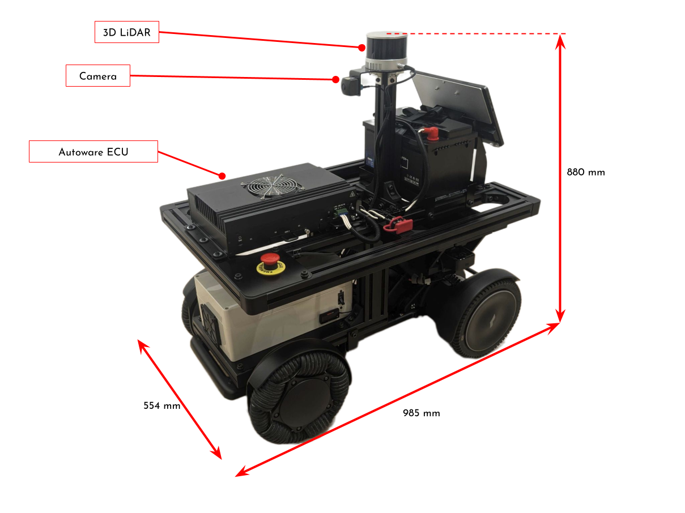
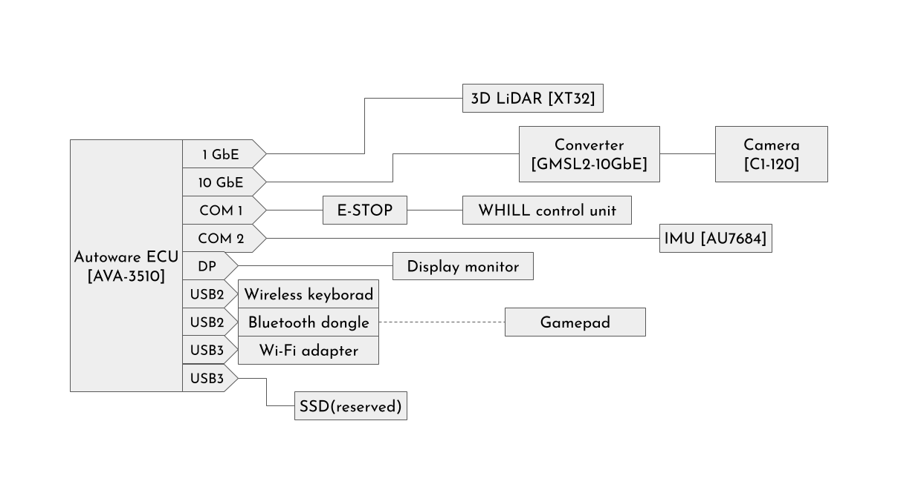

# autoware.sample_mobile_robot

## About this repository

This is an Autoware repository adjusted for mobile robots, and we hope it will be helpful for research and development and learning.
In addition to the repository configuration, we will also introduce the configuration of the mobile robot we targeted.

## Vehicle overview

### Vehicle configuration

- Base vehicle: [WHILL Powered Mobility Platform](https://whill-mrp.notion.site/WHILL-Mobile-Robot-Platform-97930066f5f64529bb83883aafef0c3b)
- Autoware ECU: [ADLINK AVA-3510](https://www.adlinktech.com/products/automotive-computing/autonomous-driving/ava-3510?lang=en)
- Sensors
  - Lidar: [Hesai XT32](https://www.hesaitech.com/product/xt16-32-32m/)
  - Camera: [TIER IV C1 camera](https://edge.auto/automotive-camera/#C1)
    - Using [GMSL2-10GbE conversion module](https://edge.auto/automotive-camera/#GMSL2-10GbE)
  - IMU: [Tamagawa AU7684](https://mems.tamagawa-seiki.com/en/product/memsimu.html#p03)

For more details on mechanical design, wiring and components, please refer to the following documents.
- [Robot Assembly Model (STEP)](docs/assembly.STEP)
- [Connection Diagram](docs/Connection%20Diagram.pdf)
- [Electrical System Parts List](docs/Electrical%20System%20Parts%20List.pdf)

## Repository overview
- [autoware.sample_mobile_robot](https://github.com/tier4/autoware.sample_mobile_robot)
  - Meta-repository containing `.repos` files to construct an Autoware workspace.
- [autoware_launch.sample_mobile_robot](https://github.com/tier4/autoware_launch.sample_mobile_robot)
  - Launch configuration repository containing node configurations and their parameters.
  - Including sensor and vehicle launcher.
- External Repositories
  - [ros2_whill](https://github.com/whill-labs/ros2_whill), [ros2_whill_interfaces](https://github.com/whill-labs/ros2_whill_interfaces)
    - Serial communication to ROS2 message conversion of WHILL platform.
  - [autoware_ros2_whill_adapter](https://github.com/tier4/autoware_ros2_whill_adapter)
    - Adapter for connecting autoware and ros2_whill.
  - [gmsl](https://github.com/analogdevicesinc/gmsl/tree/ros_rtp)
    - Camera driver using GMSL-10GbE conversion module.
    - [This PR](https://github.com/analogdevicesinc/gmsl/pull/7) is needed to enable custom timestamps.

## How to setup

### Software setup
Please refer to the [Autoware Documentation](https://autowarefoundation.github.io/autoware-documentation/main/installation/autoware/source-installation/) for installation instructions.

### Hardware setup

#### Sensors connection
- Lidar
  - Please refer to the manual for the Lidar you are using to set the IP address etc.
  - Launch file is [here](https://github.com/tier4/autoware_launch.sample_mobile_robot/blob/6685ab2ece58dfbbda19cb1f7e222526ff775a52/sensor_kit/whill_sensor_kit_launch/whill_sensor_kit_launch/launch/lidar.launch.xml).
- Camera
  - See the [GMSL-10GbE Conversion Module Getting Started Guide](https://tier4.github.io/edge-auto-docs/getting_started/gmsl-10g/gmsl-10g_getting_started_guide.html) if you use.
- IMU
  - Set the name of the device port to which the IMU is connected [here](https://github.com/tier4/autoware_launch.sample_mobile_robot/blob/6685ab2ece58dfbbda19cb1f7e222526ff775a52/sensor_kit/whill_sensor_kit_launch/whill_sensor_kit_launch/launch/imu.launch.xml#L3).

#### Sensors calibration
Please refer to the Autoware documentation to perform the required sensor calibration.
- [Ground-Lidar calibration](https://autowarefoundation.github.io/autoware-documentation/main/how-to-guides/integrating-autoware/creating-vehicle-and-sensor-model/calibrating-sensors/ground-lidar-calibration/)
- [Intrinsic camera calibration](https://autowarefoundation.github.io/autoware-documentation/main/how-to-guides/integrating-autoware/creating-vehicle-and-sensor-model/calibrating-sensors/intrinsic-camera-calibration/)
- [Lidar-Camera calibration](https://autowarefoundation.github.io/autoware-documentation/main/how-to-guides/integrating-autoware/creating-vehicle-and-sensor-model/calibrating-sensors/lidar-camera-calibration/)

#### Lidar-Camera synchronization
Below is an excerpt from the [Autoware Documentation](https://autowarefoundation.github.io/autoware-documentation/main/how-to-guides/integrating-autoware/integrating-sensors/integrating-cameras/#time-synchronization):
> Although time synchronization is recommended for achieving the best performance across varying speed conditions, it could be omitted in cases where strict control of capture timing is not crucial.
